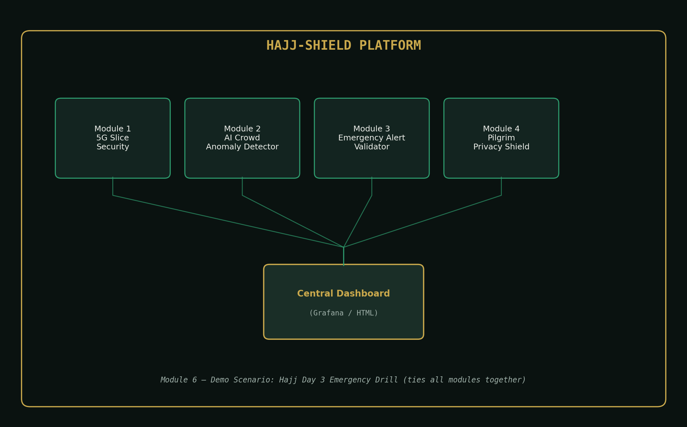

# HAJJ-SHIELD
### AI-Powered 5G Crowd Safety & Network Security Platform


[](https://github.com/tehreem-fat/hajj-shield-platform/stargazers)
[](https://github.com/tehreem-fat/hajj-shield-platform/network)
[](https://github.com/tehreem-fat/hajj-shield-platform/issues)
  



---

## Problem Statement

During Hajj, over 2.5 million pilgrims converge in a 5 sq km area. The 5G network is their lifeline — emergency alerts, crowd monitoring, medical coordination. But a single DDoS attack or sensor compromise during peak hours can trigger panic, stampede, or emergency response failure. Current security systems don't integrate telecom network defense with crowd safety.

**HAJJ-SHIELD** solves this by combining 5G network slice security, AI-driven crowd anomaly detection, emergency alert integrity verification, and pilgrim data privacy into a single operations platform.

---

## Architecture — 6 Modules

| # | Module | What it does |
|---|--------|---------------|
| 1 | **5G Slice Security** | Detects DDoS attacks on the dedicated Hajj emergency network slice using a Random Forest classifier; auto-isolates the slice and fails over to backup. |
| 2 | **AI Crowd Anomaly Detector** | Uses an Isolation Forest per zone (Mataf, Masa'a, Jamarat, King Fahd Gate) to flag sudden density surges and bottlenecks; scores each zone Green/Yellow/Red. |
| 3 | **Emergency Alert Integrity System** | HMAC-signs and verifies emergency alerts so only authorized control-room messages reach the 5G broadcast channel; a secondary NLP classifier flags panic-inducing language as a backstop. |
| 4 | **Pilgrim Privacy Shield** | Encrypts pilgrim location/ID data with Fernet (AES-128); decrypts only for `EMERGENCY_RESPONSE`-authorized requesters, with every access attempt logged and an anonymizer for analytics. |
| 5 | **Central Dashboard** | A self-contained HTML/CSS/JS command-center view (plus a Grafana config for production) showing the live zone map, network status, alert feed, threat counters, and system health. |
| 6 | **Demo Scenario** | A scripted end-to-end drill that exercises Modules 1–3 together in a realistic timeline. |

---
## 📸 Screenshots

### Central Dashboard


### Crowd Heatmap


### Network Security Status


### Alert Feed

## Demo Scenario: "Hajj Day 3 — Emergency Drill"

This is the story the platform tells when you run `demo_scenario/hajj_day3_emergency.py`:

> **[14:00]** Normal operations. Dashboard shows all zones GREEN.
>
> **[14:05]** The 5G Slice Monitor detects a DDoS attack on the Emergency Slice.
> → Alert triggered. Slice auto-isolated. Backup slice activated.
>
> **[14:07]** The Crowd Anomaly Detector flags the Jamarat zone: a density spike is detected.
> → Risk score jumps from 30 to 85.
>
> **[14:08]** A fake alert is received: *"Bridge collapsed at Jamarat!"*
> → The Alert Integrity System verifies the signature: **FAKE**. Broadcast blocked.
>
> **[14:10]** A verified alert is sent to all pilgrims via 5G broadcast:
> *"Please use alternate route to Jamarat. Gate 4 congested."*
>
> **[14:15]** Crowd density in Jamarat reduces. Risk score drops to 40.
> → Dashboard returns to GREEN.

Run it yourself:

```bash
python demo_scenario/hajj_day3_emergency.py
```

Every line above is produced live by the actual Module 1–3 code — nothing in the output is hard-coded narration.

---

## Repository Structure

```
Hajj-Shield/
├── README.md
├── requirements.txt
├── module_1_slice_security/
│   ├── generate_training_data.py
│   ├── ddos_detector.py
│   └── slice_isolator.py
├── module_2_crowd_anomaly/
│   ├── sensor_simulator.py
│   ├── anomaly_detector.py
│   └── heatmap_generator.py
├── module_3_alert_validator/
│   ├── alert_verifier.py
│   └── fake_alert_nlp.py
├── module_4_privacy_shield/
│   └── pilgrim_encryptor.py
├── dashboard/
│   ├── index.html
│   └── grafana_config.json
├── demo_scenario/
│   └── hajj_day3_emergency.py
└── docs/
    ├── architecture.png
    └── generate_architecture_diagram.py
```

---

## Getting Started

```bash
git clone https://github.com/<your-username>/Hajj-Shield.git
cd Hajj-Shield
pip install -r requirements.txt

# Run each module standalone
python module_1_slice_security/generate_training_data.py
python module_1_slice_security/ddos_detector.py

python module_2_crowd_anomaly/sensor_simulator.py
python module_2_crowd_anomaly/anomaly_detector.py
python module_2_crowd_anomaly/heatmap_generator.py   # -> haram_heatmap.html

python module_3_alert_validator/alert_verifier.py
python module_3_alert_validator/fake_alert_nlp.py

python module_4_privacy_shield/pilgrim_encryptor.py

# Run the full scripted drill
python demo_scenario/hajj_day3_emergency.py

# Open the dashboard
open dashboard/index.html   # or just double-click it
```

---

## Technology Stack

| Layer | Tool |
|---|---|
| Language | Python 3.10+ |
| ML/AI | scikit-learn (Random Forest, Isolation Forest, TF-IDF + Logistic Regression) |
| Data handling | Pandas, NumPy |
| Visualization | Folium (maps), Chart.js (dashboard), Matplotlib (diagrams) |
| Dashboard | Self-contained HTML/CSS/JS (production path: Grafana) |
| Security | `cryptography` (Fernet/AES), `hmac`/`hashlib` |
| Storage | SQLite (access + consent logs) |
| Version control | Git + GitHub |

---

## Notes on Scope

This is a **portfolio-grade working prototype**, not a production telecom deployment. A few things worth being upfront about (useful to know for interviews):

- **5G traffic and crowd sensor data are synthetically generated** (`generate_training_data.py`, `sensor_simulator.py`) with realistic statistical patterns for normal vs. attack/surge conditions — there's no live radio access network or physical sensor feed behind this.
- **Slice isolation is simulated** (`slice_isolator.py`) — in a real deployment this would call the telecom operator's Network Slice Management Function (3GPP TS 28.531 / NSMF) rather than print a log line.
- **The dashboard ships as self-contained HTML** for portability; `grafana_config.json` documents how the same panels map onto a real Grafana + InfluxDB stack.
- **The NLP fake-alert classifier is trained on a small seed set** — a real deployment would need a much larger, continuously updated labelled corpus and human-in-the-loop review before it could gate live broadcasts on its own; today it's a secondary signal alongside HMAC signature verification, which is the actual authenticity guarantee.

Being clear about what's simulated vs. what's a real, swappable implementation is part of the pitch — it shows the architecture is production-shaped even though the data isn't live yet.

---

## Author

Built by **Tehreem** — DevOps/DevSecOps Engineer (RHCSA · CKA · ISO/IEC 27001 Associate)
[GitHub](https://github.com/tehreem-fat) · [LinkedIn](https://linkedin.com/in/tehreem-f-883ba1151)
