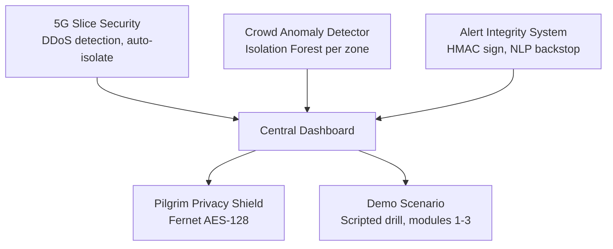
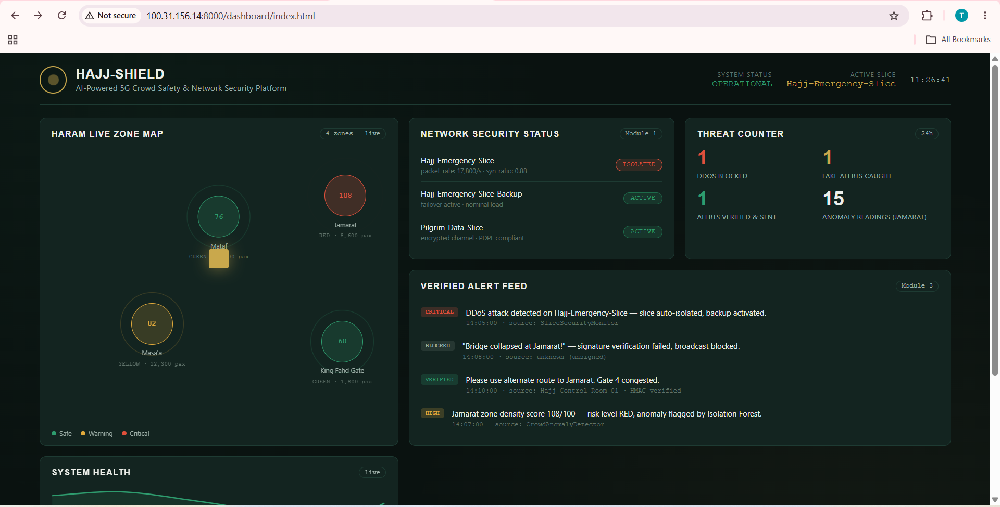
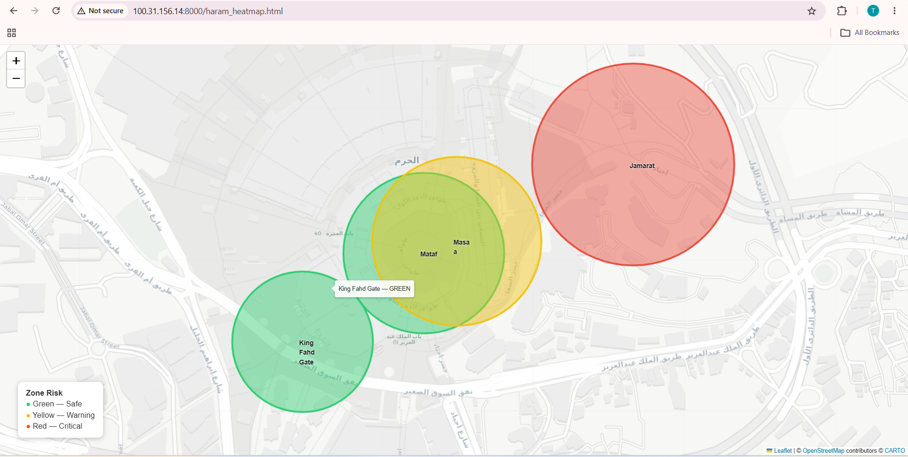
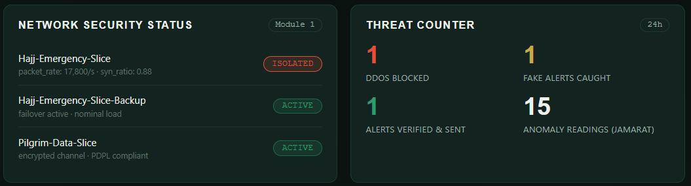
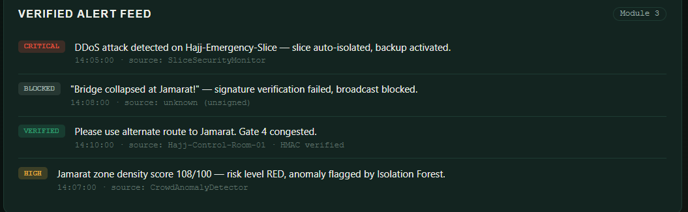

# HAJJ-SHIELD
### AI-Powered 5G Crowd Safety & Network Security Platform

[](https://github.com/tehreem-fat/hajj-shield-platform/stargazers)
[](https://github.com/tehreem-fat/hajj-shield-platform/network)
[](https://github.com/tehreem-fat/hajj-shield-platform/issues)
  



## Skills demonstrated

## Skills demonstrated
- **ML/anomaly detection:** Random Forest for DDoS classification, Isolation Forest for crowd density anomalies
- **Security engineering:** HMAC message signing/verification, Fernet (AES-128) encryption, access-controlled decryption with audit logging
- **DevSecOps practices:** threat modeling across a multi-tenant network slice, defense-in-depth (primary signature check + NLP backstop)
- **Full-stack delivery:** self-contained HTML/CSS/JS dashboard, Grafana config for production monitoring, GitHub Pages deployment
- **Python, Shell scripting**

---

## Problem Statement

During Hajj, over 2.5 million pilgrims converge in a 5 sq km area. The 5G network is their lifeline — emergency alerts, crowd monitoring, medical coordination. But a single DDoS attack or sensor compromise during peak hours can trigger panic, stampede, or emergency response failure. Current security systems don't integrate telecom network defense with crowd safety.

**HAJJ-SHIELD** solves this by combining 5G network slice security, AI-driven crowd anomaly detection, emergency alert integrity verification, and pilgrim data privacy into a single operations platform.

---

## Architecture — 6 Modules

| # | Module | What it does |
|---|--------|---------------|
| 1 | **5G Slice Security** | Detects DDoS attacks on the dedicated Hajj emergency network slice using a Random Forest classifier; auto-isolates the slice and fails over to backup. |
| 2 | **AI Crowd Anomaly Detector** | Uses an Isolation Forest per zone (Mataf, Masa'a, Jamarat, King Fahd Gate) to flag sudden density surges and bottlenecks; scores each zone Green/Yellow/Red. |
| 3 | **Emergency Alert Integrity System** | HMAC-signs and verifies emergency alerts so only authorized control-room messages reach the 5G broadcast channel; a secondary NLP classifier flags panic-inducing language as a backstop. |
| 4 | **Pilgrim Privacy Shield** | Encrypts pilgrim location/ID data with Fernet (AES-128); decrypts only for `EMERGENCY_RESPONSE`-authorized requesters, with every access attempt logged and an anonymizer for analytics. |
| 5 | **Central Dashboard** | A self-contained HTML/CSS/JS command-center view (plus a Grafana config for production) showing the live zone map, network status, alert feed, threat counters, and system health. |
| 6 | **Demo Scenario** | A scripted end-to-end drill that exercises Modules 1–3 together in a realistic timeline. |

---
## 📸 Screenshots
### Central Dashboard


### Crowd Heatmap


### Network Security Status


### Alert Feed


## 🌐 Live Demo

- **Dashboard:** https://tehreem-fat.github.io/hajj-shield-platform/dashboard/index.html
- **Heatmap:** https://tehreem-fat.github.io/hajj-shield-platform/haram_heatmap.html

## Demo Scenario: "Hajj Day 3 — Emergency Drill"

This is the story the platform tells when you run `demo_scenario/hajj_day3_emergency.py`:

> **[14:00]** Normal operations. Dashboard shows all zones GREEN.
>
> **[14:05]** The 5G Slice Monitor detects a DDoS attack on the Emergency Slice.
> → Alert triggered. Slice auto-isolated. Backup slice activated.
>
> **[14:07]** The Crowd Anomaly Detector flags the Jamarat zone: a density spike is detected.
> → Risk score jumps from 30 to 85.
>
> **[14:08]** A fake alert is received: *"Bridge collapsed at Jamarat!"*
> → The Alert Integrity System verifies the signature: **FAKE**. Broadcast blocked.
>
> **[14:10]** A verified alert is sent to all pilgrims via
> 5G broadcast:
> *"Please use alternate route to Jamarat. Gate 4 congested."*
>
> **[14:15]** Crowd density in Jamarat reduces. Risk score drops to 40.
> → Dashboard returns to GREEN.

Run it yourself:

```bash
python demo_scenario/hajj_day3_emergency.py

```

👩‍💻 Author
Tehreem Fatima — DevOps/DevSecOps Engineer

https://img.shields.io/badge/GitHub-tehreem--fat-181717?style=for-the-badge&logo=github
https://img.shields.io/badge/LinkedIn-Tehreem_Fatima-0077B5?style=for-the-badge&logo=linkedin

🏅 Certifications:

RHCSA — Red Hat Certified System Administrator

CKA — Certified Kubernetes Administrator

ISO/IEC 27001 Associate

💼 Expertise: DevOps · DevSecOps · Cloud Security · Kubernetes · CI/CD · AI/ML Security

🔗 Connect with me: GitHub · LinkedIn

⭐ Support
If you find this project useful, please give it a ⭐ on GitHub!

https://img.shields.io/github/stars/tehreem-fat/hajj-shield-platform?style=social


